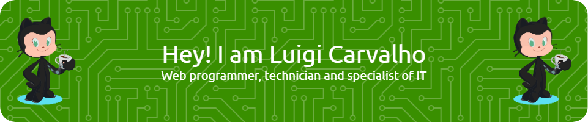

## ❓Introduction

### Hi, I'm Luis, my friends call me Luigi.

- 🔭 I’m currently working on my own projects related to LCP (Luigi Carvalho Projects).
- 🌱 I’m currently learning ASP Net Core, Angular, Blazor and C#.

- 💬 Ask me about: 

<ul>
<li>Your profession?</li>
<li>My profession is web programmer, technician and specialist of IT since 2015.</li>
</ul>

## 📫 **My Contacts and Social Networks:**

## ❗**My stats:**

  

  

 

